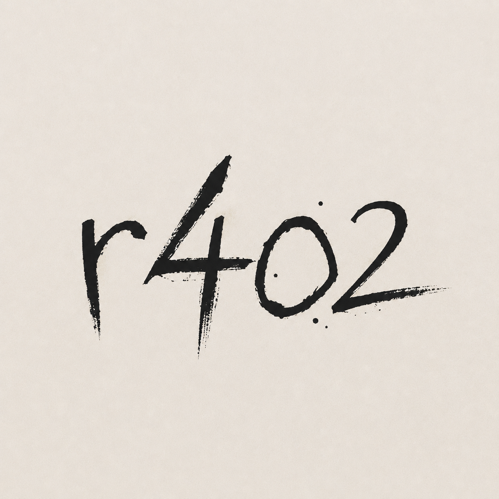

<p align="center">
  
</p>

<h1 align="center">r402 Sentinel</h1>

<p align="center">
  <strong>Proof-bound agent firewall for MetaMask Smart Accounts.</strong><br />
  One bounded permission. Narrow child agents. Every payment tied to the exact request.
</p>

<p align="center">
  <a href="docs/architecture.md"><strong>Architecture</strong></a> ·
  <a href="docs/threat-model.md">Threat Model</a> ·
  <a href="#quick-start">Quick Start</a> ·
  <a href="#demo-flow">Demo Flow</a>
</p>

---

## The problem

Autonomous agents need to spend money, call contracts, and buy data. Most stacks solve this with a hot wallet, a broad API key, or a vague "trust the bot" policy. That fails the moment an agent replays a payment, swaps a target contract, leaks PII into x402 metadata, or keeps acting after the user revokes access.

**r402 Sentinel** treats agent autonomy as a *permission problem*, not a prompt problem. The user grants one root budget. The orchestrator narrows it. Every paid request is cryptographically bound to the plan, quote, and delegation that authorized it. Replay, substitution, and over-broad scope are blocked before money moves.

## What it does

| Layer | Responsibility |
| --- | --- |
| **Planner** | Venice (or Groq fallback) turns natural-language intent into a minimum-authority `ExecutionPlan` |
| **Policy engine** | Scores risk, enforces seller allowlists, and rejects over-broad budgets |
| **Permission tree** | ERC-7715 root → ERC-7710 child agents (Payment, Execution, Proof) — each narrower than its parent |
| **Payment guard** | x402 request digest binds method, URL, body, quote, plan, and delegation |
| **Relay adapter** | 1Shot capabilities → estimate → send (7702 / 7710 execution bundle) |
| **Proof anchor** | `ProofRegistry` consumes the digest once and stores an auditable proof hash |

The core invariant:

> **No child receives more authority than its parent. No paid request can be detached from the exact quote, plan, or delegation that authorized it.**

For the full system design — component boundaries, data flows, hash construction, and live vs demo adapters — see **[Architecture](docs/architecture.md)**.

---

## Architecture at a glance

```text
User intent
  → Venice Planner + Risk Policy          (@r402/core)
  → ERC-7715 root periodic USDC permission (MetaMask Smart Accounts)
  → Session Orchestrator
       → Payment Guard   : x402 seller · ≤ $2 · 10 min
       → Execution Agent : 1Shot target · ≤ $5 · selector scope
       → Proof Agent     : read + ProofRegistry anchor only
  → requestDigest(method, URL, body, quote, plan, delegation)
  → idempotency lock
  → x402 paid request
  → 1Shot capabilities · estimate · send
  → ProofRegistry.consumeRequest + anchorProof
  → revoke root permission
```

**Read the deep dive:** [docs/architecture.md](docs/architecture.md)

---

## Monorepo layout

```text
r402/
├── apps/web/                  Next.js 16 dashboard + API routes
│   ├── app/api/plan/          Venice / Groq planner endpoint
│   ├── app/api/executions/    x402 binding, idempotency, proof manifest
│   ├── components/            SentinelDashboard UI
│   └── lib/metamask.ts        Live ERC-7715 permission request
├── packages/core/             Policy, hashing, delegation tree, idempotency
├── contracts/                 ProofRegistry.sol (Foundry)
├── docs/
│   ├── architecture.md        System design (start here for internals)
│   └── threat-model.md        Threat → control mapping
└── tests/e2e/                 Playwright end-to-end demo flow
```

---

## Quick start

**Requirements:** Node.js 20+, npm 10+. Optional: Foundry (contract tests), MetaMask Flask 13.5+ (live ERC-7715).

```bash
git clone <repo-url> r402 && cd r402
npm install
npm run dev
```

Open **[http://localhost:3000](http://localhost:3000)**. The complete demo flow runs with **zero credentials**.

Root `.env.local` is loaded automatically by the web app (`apps/web/next.config.ts`).

---

## Configuration

| Variable | Required | Description |
| --- | --- | --- |
| `VENICE_API_KEY` | No | Enable live Venice planner inference |
| `VENICE_MODEL` | No | Default: `venice-uncensored-1-2` |
| `GROQ_API_KEY` | No | Free fallback if Venice is unavailable |
| `GROQ_MODEL` | No | Default: `openai/gpt-oss-20b` |
| `NEXT_PUBLIC_SESSION_ACCOUNT` | No | Session account address for live ERC-7715 grant prompt |
| `ONE_SHOT_LIVE` | No | Reserved for live 1Shot relay adapter |
| `ONE_SHOT_RELAYER_URL` | No | Default: `https://relayer.1shotapi.com/relayers` |
| `NEXT_PUBLIC_BASE_EXPLORER` | No | Default: `https://basescan.org` |

**Planner fallback chain:** Venice live → Groq live → deterministic demo plan.

**Permission modes:**

- **Demo** (default): simulated ERC-7715 grant, simulated relay, deterministic proof artifacts.
- **Live grant**: set `NEXT_PUBLIC_SESSION_ACCOUNT` to your session smart account address. Connect MetaMask on Base, grant the periodic USDC permission. Requires MetaMask Flask with Smart Account upgrade.

Copy `.env.example` to `.env.local` and fill in what you need.

---

## Demo flow

Walk through the dashboard in order:

1. **Build a minimum-authority plan** — enter intent, run the Venice policy planner.
2. **Grant the root permission** — simulated periodic USDC scope ($20 / 24h on Base).
3. **Inspect the authority map** — Payment Guard, Execution Agent, Proof Agent — each narrower than the root.
4. **Execute the protected flow** — x402 binding → relay → proof manifest.
5. **Replay the exact request** — idempotency guard returns `409 REPLAY_BLOCKED`.
6. **Revoke the root** — all child agents disable immediately.

The UI labels simulated artifacts explicitly. Live adapters plug into the same boundaries documented in [Architecture → Live integration](docs/architecture.md#live-integration-boundaries).

---

## Verification

```bash
npm test              # @r402/core unit tests (digest, delegation, idempotency, PII)
npm run test:e2e      # Playwright: plan → grant → execute → replay block → revoke
npm run test:contracts # Foundry: ProofRegistry consume + anchor
npm run build         # Production build
npm run lint          # TypeScript check
```

---

## Security

Sentinel is designed **fail-closed**: stale quotes, unknown targets, duplicate digests, revoked permissions, and over-broad child scopes stop the chain before payment.

| Threat | Control |
| --- | --- |
| Payment replay | Deterministic `requestDigest` + `IdempotencyGuard` |
| Cross-resource substitution | Bind method, URL, body, quote, plan, delegation |
| Over-broad child agent | Every child budget ≤ parent; targets narrowed per role |
| PII in x402 metadata | `sanitizeMetadata()` strips sensitive keys pre-flight |
| Revoked permission reuse | Root revocation disables all children |

Full threat model: **[docs/threat-model.md](docs/threat-model.md)**

---

## Tech stack

- **Runtime:** Next.js 16, React 19, TypeScript
- **Chain:** Base (chain ID 8453), viem, MetaMask Smart Accounts Kit (ERC-7715 / 7710)
- **Inference:** Venice AI, Groq (structured JSON fallback)
- **Payments:** x402 request binding
- **Relay:** 1Shot permissionless relayer (7702 / 7710 bundles)
- **Contracts:** Solidity 0.8.24, Foundry
- **Core logic:** `@r402/core` — canonical hashing, policy, delegation tree, proof manifest

---

## Live integration boundaries

These files are the adapter seams. Wire live credentials and onchain context here without rewriting the dashboard:

| Boundary | File | Responsibility |
| --- | --- | --- |
| Planner | `apps/web/app/api/plan/route.ts` | Venice / Groq → constrained `ExecutionPlan` |
| Execution | `apps/web/app/api/executions/route.ts` | Digest lock, x402, relay, proof manifest |
| Policy & crypto | `packages/core/src/index.ts` | Hashing, risk, delegation tree, PII filter |
| Permissions | `apps/web/lib/metamask.ts` | Live ERC-7715 periodic USDC grant |
| Onchain proof | `contracts/src/ProofRegistry.sol` | One-time digest consumption + proof anchor |

Before production submission: wire the granted permission context, signed 7710 bundle, live 1Shot task, and deployed `ProofRegistry` address into these boundaries.

---

<p align="center"><strong>Proof over promises.</strong></p>
