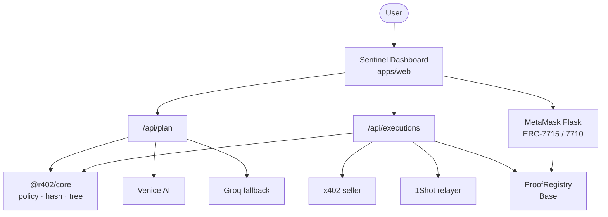
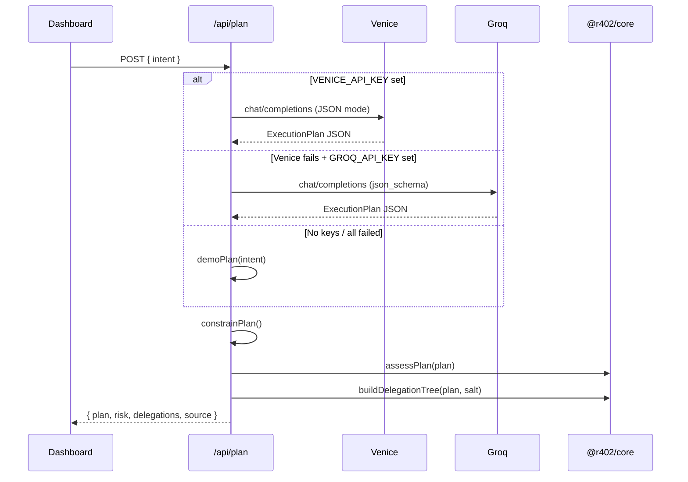
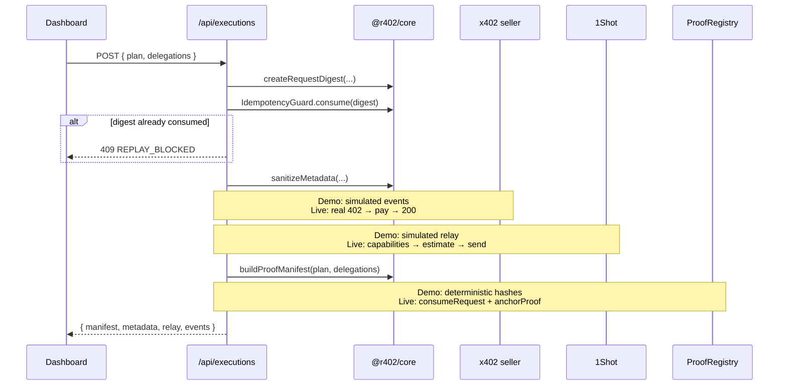

# Architecture

**r402 Sentinel** is a proof-bound agent firewall. It connects natural-language intent, wallet permissions, paid HTTP requests, relayed onchain execution, and an auditable proof manifest into one coherent, revocable chain.

This document is the authoritative system design reference. For threat controls, see [threat-model.md](./threat-model.md). For setup and demo instructions, see [README](../README.md).

---

## Table of contents

1. [Design principles](#design-principles)
2. [System context](#system-context)
3. [End-to-end flow](#end-to-end-flow)
4. [Monorepo components](#monorepo-components)
5. [Execution plan & policy](#execution-plan--policy)
6. [Permission model](#permission-model)
7. [Cryptographic binding](#cryptographic-binding)
8. [Planning pipeline](#planning-pipeline)
9. [Execution pipeline](#execution-pipeline)
10. [Proof manifest](#proof-manifest)
11. [API reference](#api-reference)
12. [Onchain contracts](#onchain-contracts)
13. [Dashboard phases](#dashboard-phases)
14. [Live integration boundaries](#live-integration-boundaries)
15. [Extension points](#extension-points)

---

## Design principles

### 1. Minimum authority

Agents receive the *smallest* scope that completes the mission. The planner caps budgets, filters targets against allowlists, and the delegation tree ensures every child is strictly narrower than its parent.

### 2. Request binding

A payment is not "for research." It is for **this** HTTP method, **this** canonical URL, **this** body, **this** quote, **this** plan hash, and **this** delegation hash — combined into a single `requestDigest`. Change any input and the digest changes.

### 3. Fail closed

Unknown sellers, replayed digests, revoked root permissions, stale relay estimates, and policy violations halt execution before funds move. The system defaults to *stop*, not *continue*.

### 4. Proof over promises

Every successful run produces a `ProofManifest`: deterministic hashes linking plan, delegation, request, relay task, transaction, and final proof. Simulated artifacts in demo mode use the same schema as live mode.

### 5. Adapter seams

Demo and production share one UI and one core library. Live Venice inference, MetaMask permissions, x402 settlement, 1Shot relay, and onchain anchoring plug into explicit adapter boundaries — not scattered conditionals.

---

## System context



**Trust boundaries:**

| Boundary | Trusts | Does not trust |
| --- | --- | --- |
| User → Sentinel | Own wallet, own intent | Unbounded agent scope |
| Planner → Core | JSON schema validation | Raw LLM output without constraint |
| Execution → x402 | Signed quote for bound URL | Detached or replayed requests |
| Relay → 1Shot | Capability-derived targets | Hardcoded contract addresses |
| Proof → Registry | One-time digest consumption | Duplicate proof claims |

---

## End-to-end flow

```text
┌─────────────┐
│ User intent │  natural language mission statement
└──────┬──────┘
       ▼
┌─────────────────────┐
│ Venice Planner      │  JSON ExecutionPlan + risk assessment
│ + Risk Policy       │  allowlist filter · budget cap · verdict
└──────┬──────────────┘
       ▼
┌─────────────────────┐
│ ERC-7715 root       │  periodic USDC · $20 / 24h · Base
│ permission grant    │  MetaMask Smart Account → session account
└──────┬──────────────┘
       ▼
┌─────────────────────┐
│ Session Orchestrator│  builds ERC-7710 delegation tree
│                     │
│  ├─ Payment Guard   │  x402 seller · ≤ $2 · 10 min TTL
│  ├─ Execution Agent │  1Shot target · ≤ $5 · selector scope
│  └─ Proof Agent     │  read-only · ProofRegistry anchor · $0
└──────┬──────────────┘
       ▼
┌─────────────────────┐
│ requestDigest       │  keccak256(method, url, bodyHash,
│                     │            quoteHash, planHash, delegationHash)
└──────┬──────────────┘
       ▼
┌─────────────────────┐
│ Idempotency lock    │  reject duplicate digest (409 REPLAY_BLOCKED)
└──────┬──────────────┘
       ▼
┌─────────────────────┐
│ x402 paid request   │  HTTP 402 → pay → 200 + PAYMENT-RESPONSE
│ + PII sanitization  │  strip email, wallet, secrets from metadata
└──────┬──────────────┘
       ▼
┌─────────────────────┐
│ 1Shot relay         │  getCapabilities → estimate → send
│                     │  7702 / 7710 execution bundle
└──────┬──────────────┘
       ▼
┌─────────────────────┐
│ ProofRegistry       │  consumeRequest(digest) · anchorProof(jobId, …)
└──────┬──────────────┘
       ▼
┌─────────────────────┐
│ Revoke root         │  disable all child agents immediately
└─────────────────────┘
```

---

## Monorepo components

### `apps/web` — Dashboard & API

| Path | Role |
| --- | --- |
| `components/SentinelDashboard.tsx` | Six-phase UX: intent → plan → grant → execute → proof → revoke |
| `app/api/plan/route.ts` | Planner adapter (Venice → Groq → deterministic) |
| `app/api/executions/route.ts` | Execution adapter (digest, idempotency, manifest) |
| `lib/metamask.ts` | Live ERC-7715 `requestExecutionPermissions` on Base USDC |
| `app/layout.tsx` | App shell, metadata, favicon from root `r402.png` |

The web app loads root `.env.local` via `next.config.ts`. `experimental.externalDir` allows importing assets from the monorepo root.

### `packages/core` — Shared logic

Pure TypeScript. No I/O. Used by API routes and unit tests.

| Export | Purpose |
| --- | --- |
| `planSchema` | Zod validation for `ExecutionPlan` |
| `hashValue` | Canonical JSON → keccak256 |
| `createRequestDigest` | Bind HTTP request to authorization context |
| `assessPlan` | Risk score, verdict, findings |
| `buildDelegationTree` | Narrow ERC-7710 child scopes from plan |
| `buildProofManifest` | Deterministic proof artifact bundle |
| `sanitizeMetadata` | PII strip before x402 payment |
| `IdempotencyGuard` | In-memory replay protection (swap for Redis in prod) |

### `contracts` — Onchain proof

`ProofRegistry.sol`:

- `consumeRequest(bytes32)` — marks digest as spent; reverts on replay
- `anchorProof(bytes32 jobId, bytes32 delegationHash, bytes32 proofHash)` — stores latest proof per job

Foundry tests cover consume-once semantics and anchor storage.

---

## Execution plan & policy

### `ExecutionPlan` schema

```typescript
{
  intent: string;              // min 8 chars — user's mission
  chainId: 8453;               // Base only
  maxBudgetUSDC: number;       // 0.01 – 20
  x402Resources: string[];     // 1–3 absolute HTTPS URLs
  allowedTargets: string[];    // 1–5 contract addresses
  requiredFunctions: string[]; // 1–5 function selectors
  justification: string;
  proofSummary: string;
}
```

Validated by `planSchema` in `packages/core/src/types.ts`.

### Planner constraints

Even when Venice or Groq returns a plan, `constrainPlan()` in the plan route enforces:

- `chainId` locked to 8453
- `maxBudgetUSDC` capped at 8 for autonomous execution
- `x402Resources` filtered to server-side allowlist
- `allowedTargets` filtered to server-side allowlist
- `requiredFunctions` filtered to known selectors

This prevents the LLM from expanding authority beyond policy.

### Risk assessment

`assessPlan()` produces:

| Field | Meaning |
| --- | --- |
| `score` | 0–92 composite risk |
| `verdict` | `allow` · `review` · `block` |
| `findings` | Policy violations or clean bill |
| `controls` | Active safeguards (digest binding, idempotency, caveats, PII filter) |

Triggers include unknown x402 sellers and budgets above recommended autonomous limits.

---

## Permission model

Sentinel implements a three-tier delegation tree derived from the approved plan.

```text
Session Orchestrator (root)
│  ERC-7715 periodic USDC
│  limit: min(plan.maxBudgetUSDC, 20)
│  TTL: 24 hours
│
├── Payment Guard
│     role: x402 paid request
│     limit: min(2, root)
│     targets: plan.x402Resources
│     TTL: 10 minutes
│
├── Execution Agent
│     role: 1Shot relay
│     limit: min(5, root)
│     targets: plan.allowedTargets (first 2)
│     TTL: 10 minutes
│
└── Proof Agent
      role: read + anchor only
      limit: 0 USDC
      targets: ProofRegistry
      TTL: 30 minutes
```

**Invariant:** `child.limitUSDC ≤ parent.limitUSDC` for every node. Verified in unit tests.

### ERC-7715 root grant (live mode)

`apps/web/lib/metamask.ts` requests:

```typescript
requestExecutionPermissions([{
  chainId: base.id,
  expiry: now + 24h,
  to: sessionAccount,           // NEXT_PUBLIC_SESSION_ACCOUNT
  permission: {
    type: "erc20-token-periodic",
    data: {
      tokenAddress: BASE_USDC,  // 0x833589…2913
      periodAmount: 20 USDC,
      periodDuration: 86400,
    },
  },
}])
```

The **session account** is the agent identity that receives the permission — not the user's connected EOA. The user grants; the session account redeems.

Requirements for live grant:

- MetaMask Flask 13.5+
- User upgraded to MetaMask Smart Account on Base
- `NEXT_PUBLIC_SESSION_ACCOUNT` set to session smart account address

---

## Cryptographic binding

### Canonical hashing

`hashValue()` serializes objects with sorted keys before keccak256. Identical semantic content → identical hash regardless of key order.

### Request digest

```typescript
requestDigest = hash({
  method: "POST",                    // uppercased
  url: plan.x402Resources[0],
  bodyHash: hash(body),
  quoteHash: hash({ chainId, asset, amount }),
  planHash: hash(plan),
  delegationHash: hash(delegations),
})
```

**Why each field matters:**

| Field | Prevents |
| --- | --- |
| `method` | GET/POST substitution |
| `url` | Cross-resource payment routing |
| `bodyHash` | Payload tampering after quote |
| `quoteHash` | Stale or swapped price acceptance |
| `planHash` | Execution outside approved scope |
| `delegationHash` | Permission context substitution |

### Idempotency

`IdempotencyGuard` (in-memory in demo; replace with durable store in production) rejects a digest that was already consumed. The executions route returns:

```json
{ "error": "Duplicate x402 request blocked", "code": "REPLAY_BLOCKED", "requestDigest": "0x…" }
```

HTTP **409**. Matches onchain `ProofRegistry.consumeRequest` semantics.

---

## Planning pipeline



**Planner system prompt** instructs the model to return strict JSON only, never expand authority, and never claim research has already occurred.

**Source values:** `venice-live` · `groq-live` · `deterministic-fallback`

---

## Execution pipeline



### PII sanitization

Before x402 payment, metadata passes through `sanitizeMetadata()`. Keys matching `/email|phone|name|address|wallet|secret|token|password/i` are removed. The response includes both `clean` payload and `removed` key list for audit.

---

## Proof manifest

Returned by `buildProofManifest()`:

| Field | Description |
| --- | --- |
| `jobId` | Unique job identifier (hash of digest + timestamp) |
| `planHash` | Hash of approved `ExecutionPlan` |
| `delegationHash` | Hash of delegation tree |
| `requestDigest` | Bound payment identifier |
| `quoteHash` | Hash of accepted price quote |
| `relayTaskId` | 1Shot task reference |
| `transactionHash` | Base transaction hash |
| `proofHash` | Final composite proof |
| `paidUSDC` | Amount settled (demo: 0.18) |
| `anchoredAt` | ISO timestamp |
| `status` | `confirmed` |

In demo mode all hashes are deterministically derived. In live mode the same fields populate from real relay and registry events.

---

## API reference

### `POST /api/plan`

**Request:**

```json
{ "intent": "Research the safest Base USDC yield opportunity…" }
```

**Response (200):**

```json
{
  "plan": { "intent": "…", "chainId": 8453, "maxBudgetUSDC": 8, "…": "…" },
  "risk": { "score": 18, "verdict": "allow", "note": "…", "findings": [], "controls": [], "piiFindings": [] },
  "delegations": [{ "id": "root:…", "label": "Session Orchestrator", "…": "…" }],
  "source": "venice-live",
  "warning": "optional fallback notice"
}
```

**Errors:** `400` intent too short · `500` planner failure

### `POST /api/executions`

**Request:**

```json
{
  "plan": { "…": "ExecutionPlan" },
  "delegations": [{ "…": "DelegationNode" }]
}
```

**Response (200):**

```json
{
  "manifest": { "jobId": "0x…", "requestDigest": "0x…", "…": "…" },
  "metadata": { "clean": { "query": "…" }, "removed": ["email", "wallet_label"] },
  "relay": { "provider": "1Shot permissionless relayer", "status": "confirmed", "…": "…" },
  "events": [{ "label": "402 challenge received", "detail": "…" }]
}
```

**Errors:** `409 REPLAY_BLOCKED` · `500` validation failure

---

## Onchain contracts

### `ProofRegistry`

```solidity
mapping(bytes32 => bool) public consumedRequestDigests;
mapping(bytes32 => bytes32) public latestProofHashByJob;

function consumeRequest(bytes32 requestDigest) external;
function anchorProof(bytes32 jobId, bytes32 delegationHash, bytes32 proofHash) external;
```

**Events:**

- `RequestConsumed(bytes32 indexed requestDigest)`
- `ProofAnchored(bytes32 indexed jobId, bytes32 indexed delegationHash, bytes32 proofHash)`

**Replay protection:** `consumeRequest` reverts with `RequestAlreadyConsumed` if the digest was already spent.

Deploy to Base and pass the address into the execution adapter for live anchoring.

---

## Dashboard phases

The UI tracks six phases with explicit state transitions:

| Phase | User action | System state |
| --- | --- | --- |
| `intent` | Enter mission | Awaiting plan |
| `planned` | Build plan | Plan + risk + delegation tree ready |
| `granted` | Grant permission | Root scope active |
| `executing` | Execute flow | Digest locked, relay in progress |
| `confirmed` | — | Proof manifest anchored |
| `revoked` | Revoke root | All agents disabled; execution blocked |

**Adversarial controls** (panel 07):

- **Replay exact request** — expects `409` before payment
- **Revoke root delegation** — immediately zeroes budget and blocks execution

---

## Live integration boundaries

The demo intentionally simulates relay and registry steps while preserving real adapter interfaces. Wire production here:

| Component | File | To go live |
| --- | --- | --- |
| Planner | `apps/web/app/api/plan/route.ts` | Already supports Venice + Groq; tighten allowlists for production |
| Permission grant | `apps/web/lib/metamask.ts` | Set `NEXT_PUBLIC_SESSION_ACCOUNT`; user on MetaMask Flask + Smart Account |
| x402 settlement | `apps/web/app/api/executions/route.ts` | Replace simulated 402 flow with real payment + `PAYMENT-RESPONSE` header |
| 1Shot relay | `apps/web/app/api/executions/route.ts` | `ONE_SHOT_LIVE=true`; call `relayer_getCapabilities`, estimate, send with 7710 bundle |
| Idempotency | `packages/core` `IdempotencyGuard` | Swap in-memory set for Redis / onchain `consumeRequest` first |
| Proof anchor | `contracts/src/ProofRegistry.sol` | Deploy; call `consumeRequest` + `anchorProof` with real tx hashes |
| Delegation signing | Not yet wired | Pass granted permission context into `createDelegation` + `signDelegation` from Smart Accounts Kit |

**Do not** scatter live/demo branching across the UI. Keep all production wiring in the adapter files above.

---

## Extension points

### Add a new x402 seller

1. Add URL prefix to `SELLER_ALLOWLIST` in `packages/core/src/index.ts`
2. Add URL to `allowedResources` in `apps/web/app/api/plan/route.ts`
3. Update planner system prompt if needed

### Add a new child agent role

1. Extend `buildDelegationTree()` with a new node — ensure `limitUSDC ≤ parent`
2. Add UI card in `SentinelDashboard.tsx` delegation panel
3. Wire redemption in execution adapter with narrowed 7710 caveats

### Harden for production

- Durable idempotency (Redis + TTL aligned with quote expiry)
- Webhook signature verification for 1Shot terminal status
- Onchain-first digest consumption before x402 payment
- Rate limiting on `/api/plan` and `/api/executions`
- Structured logging with `requestDigest` correlation ID

---

## Related documents

- [README](../README.md) — quick start, configuration, demo flow
- [Threat Model](./threat-model.md) — threat → control matrix
