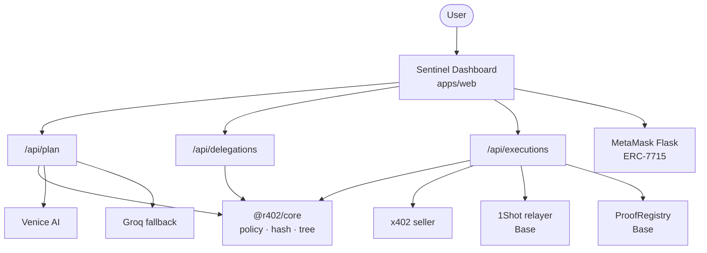
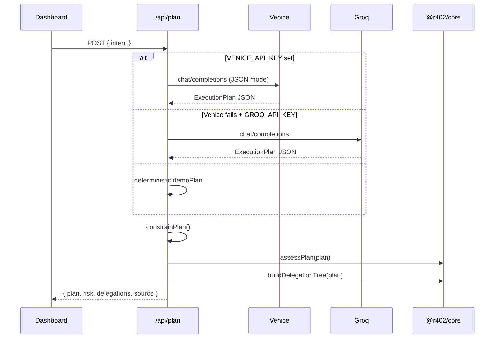
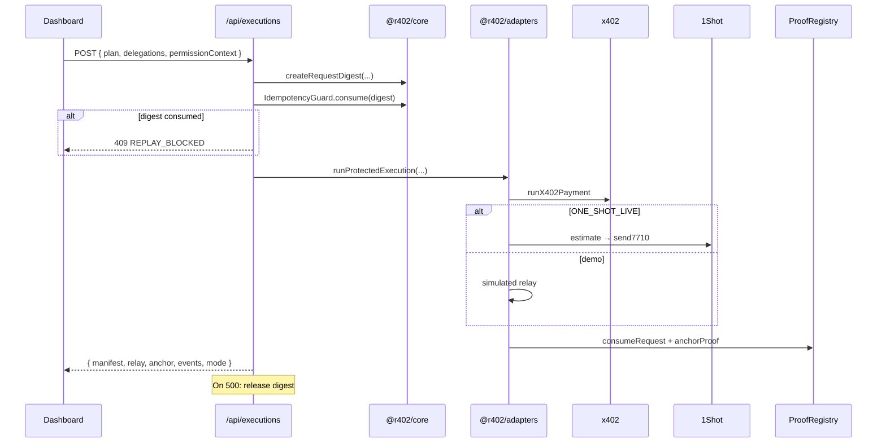

# Architecture

**r402 Sentinel** is a proof-bound agent firewall. It connects natural-language intent, wallet permissions, paid HTTP requests, relayed onchain execution, and an auditable proof manifest into one coherent, revocable chain.

This document is the authoritative system design reference. For threat controls, see [threat-model.md](./threat-model.md). For setup and demo instructions, see [README](../README.md).

---

## Table of contents

1. [Design principles](#design-principles)
2. [System context](#system-context)
3. [End-to-end flow](#end-to-end-flow)
4. [Monorepo components](#monorepo-components)
5. [Execution plan & policy](#execution-plan--policy)
6. [Permission model](#permission-model)
7. [1Shot relay bundle](#1shot-relay-bundle)
8. [Cryptographic binding](#cryptographic-binding)
9. [Planning pipeline](#planning-pipeline)
10. [Execution pipeline](#execution-pipeline)
11. [Proof manifest](#proof-manifest)
12. [API reference](#api-reference)
13. [Onchain contracts](#onchain-contracts)
14. [Dashboard phases](#dashboard-phases)
15. [Live vs demo modes](#live-vs-demo-modes)
16. [Live integration boundaries](#live-integration-boundaries)
17. [Extension points](#extension-points)

---

## Design principles

### 1. Minimum authority

Agents receive the *smallest* scope that completes the mission. The planner caps budgets, filters targets against allowlists, and the delegation tree ensures every child is strictly narrower than its parent.

### 2. Request binding

A payment is not "for research." It is for **this** HTTP method, **this** canonical URL, **this** body, **this** quote, **this** plan hash, and **this** delegation hash — combined into a single `requestDigest`. Change any input and the digest changes.

### 3. Fail closed

Unknown sellers, replayed digests, revoked root permissions, stale relay estimates, blank permission contexts, and policy violations halt execution before funds move. The system defaults to *stop*, not *continue*.

### 4. Proof over promises

Every successful run produces a `ProofManifest`: hashes linking plan, delegation, request, relay task, and on-chain transactions where available. Demo mode uses the same schema; live mode populates real relay and registry txs. BaseScan links appear only for verified on-chain hashes.

### 5. Adapter seams

Demo and production share one UI and one core library. Live Venice inference, MetaMask permissions, x402 settlement, 1Shot relay, and onchain anchoring plug into `@r402/adapters` — not scattered conditionals in the UI.

---

## System context



**Trust boundaries:**

| Boundary | Trusts | Does not trust |
| --- | --- | --- |
| User → Sentinel | Own wallet, own intent | Unbounded agent scope |
| Planner → Core | JSON schema validation | Raw LLM output without constraint |
| Grant → 1Shot | `targetAddress` from capabilities | Session account as grant recipient |
| Execution → x402 | Signed quote for bound URL | Detached or replayed requests |
| Relay → 1Shot | Estimate `context` within ~45s | Stale fee quotes |
| Proof → Registry | One-time digest consumption | Duplicate proof claims |

---

## End-to-end flow

```text
┌─────────────┐
│ User intent │  natural language mission statement
└──────┬──────┘
       ▼
┌─────────────────────┐
│ Venice Planner      │  JSON ExecutionPlan + risk assessment
│ + Risk Policy       │  allowlist filter · budget cap · verdict
└──────┬──────────────┘
       ▼
┌─────────────────────┐
│ ERC-7715 root       │  periodic USDC · $20 / 24h · Base
│ permission grant    │  MetaMask Flask → 1Shot relayer targetAddress
└──────┬──────────────┘
       ▼
┌─────────────────────┐
│ Policy tree         │  Payment / Execution / Proof scopes (UI + plan binding)
│ (7710 when enabled) │  When ONE_SHOT_LIVE: grant is direct; tree is informational
└──────┬──────────────┘
       ▼
┌─────────────────────┐
│ requestDigest       │  keccak256(method, url, bodyHash,
│                     │            quoteHash, planHash, delegationHash)
└──────┬──────────────┘
       ▼
┌─────────────────────┐
│ Idempotency lock    │  reject duplicate digest (409 REPLAY_BLOCKED)
│                     │  released on execution failure (500) for retry
└──────┬──────────────┘
       ▼
┌─────────────────────┐
│ x402 paid request   │  HTTP 402 → pay → 200 + PAYMENT-RESPONSE
│ + PII sanitization  │  strip email, wallet, secrets from metadata
└──────┬──────────────┘
       ▼
┌─────────────────────┐
│ 1Shot relay         │  getCapabilities → getFeeData → estimate → send
│                     │  two USDC transfer legs (fee + work)
└──────┬──────────────┘
       ▼
┌─────────────────────┐
│ ProofRegistry       │  consumeRequest(digest) · anchorProof(jobId, …)
└──────┬──────────────┘
       ▼
┌─────────────────────┐
│ Revoke root         │  MetaMask wallet_revokeExecutionPermission (live)
└─────────────────────┘
```

---

## Monorepo components

### `apps/web` — Dashboard & API

| Path | Role |
| --- | --- |
| `components/SentinelDashboard.tsx` | Six-step UX: Plan → Grant → Permit → Pay → Relay → Proof → Revoke |
| `app/api/plan/route.ts` | Planner adapter (Venice → Groq → deterministic) |
| `app/api/delegations/route.ts` | ERC-7710 signing or policy tree when `ONE_SHOT_LIVE` |
| `app/api/executions/route.ts` | Digest lock, x402, 1Shot, proof manifest |
| `app/api/budget/route.ts` | ERC-20 period transfer enforcer available amount |
| `app/api/revoke/route.ts` | Demo revoke or server-side simulated disable |
| `lib/metamask.ts` | Live ERC-7715 `requestExecutionPermissions` on Base |
| `next.config.ts` | Loads root `.env.local`; exposes `ONE_SHOT_LIVE` / `X402_LIVE` to client |

### `packages/core` — Shared logic

Pure TypeScript. No I/O. Used by API routes and unit tests.

| Export | Purpose |
| --- | --- |
| `planSchema` | Zod validation for `ExecutionPlan` |
| `hashValue` | Canonical JSON → keccak256 |
| `createRequestDigest` | Bind HTTP request to authorization context |
| `assessPlan` | Risk score, verdict, findings |
| `buildDelegationTree` | Narrow ERC-7710 child scopes from plan |
| `buildProofManifest` | Proof artifact bundle (no synthetic tx hashes) |
| `sanitizeMetadata` | PII strip before x402 payment |
| `IdempotencyGuard` | In-memory replay protection (`release` on failed execute) |

### `packages/adapters` — Live integrations

| Module | Purpose |
| --- | --- |
| `oneshot.ts` | 1Shot JSON-RPC: capabilities, fee, estimate, send |
| `x402.ts` | x402 paid request flow |
| `proof.ts` | ProofRegistry consume + anchor |
| `delegation.ts` | ERC-7710 redelegation signing, budget read, revoke guard |
| `execution.ts` | Orchestrates x402 + 1Shot + proof for `/api/executions` |
| `env.ts` | Central env flags (`oneShotLive`, `x402Live`, etc.) |

### `contracts` — Onchain proof

`ProofRegistry.sol`:

- `consumeRequest(bytes32)` — marks digest as spent; reverts on replay
- `anchorProof(bytes32 jobId, bytes32 delegationHash, bytes32 proofHash)` — stores latest proof per job

Foundry tests cover consume-once semantics and anchor storage.

---

## Execution plan & policy

### `ExecutionPlan` schema

```typescript
{
  intent: string;              // min 8 chars — user's mission
  chainId: 8453;               // Base only
  maxBudgetUSDC: number;       // 0.01 – 20
  x402Resources: string[];     // 1–3 absolute HTTPS URLs
  allowedTargets: string[];    // 1–5 contract addresses
  requiredFunctions: string[]; // 1–5 function selectors
  justification: string;
  proofSummary: string;
}
```

### Planner constraints

Even when Venice or Groq returns a plan, `constrainPlan()` enforces:

- `chainId` locked to 8453
- `maxBudgetUSDC` capped at 8 for autonomous execution
- `x402Resources` and `allowedTargets` filtered to server-side allowlists
- `requiredFunctions` filtered to known selectors

### Risk assessment

`assessPlan()` produces score (0–92), verdict (`allow` · `review` · `block`), findings, and active controls.

**Source values:** `venice-live` · `groq-live` · `deterministic-fallback`

---

## Permission model

### Policy tree (UI + binding)

```text
Session Orchestrator (root)
│  ERC-7715 periodic USDC · $20 / 24h · Base
│
├── Payment Guard     · x402 · ≤ $2 · 10 min
├── Execution Agent   · 1Shot · ≤ $5 · 10 min
└── Proof Agent       · ProofRegistry · read/anchor · $0
```

**Invariant:** `child.limitUSDC ≤ parent.limitUSDC` for every node.

### ERC-7715 root grant (live mode)

`apps/web/lib/metamask.ts` requests periodic USDC permission with:

```typescript
requestExecutionPermissions([{
  chainId: base.id,
  from: grantor,                    // user's connected Smart Account
  expiry: now + 24h,
  to: grantTarget,                  // 1Shot relayer targetAddress — NOT session account
  permission: {
    type: "erc20-token-periodic",
    isAdjustmentAllowed: true,
    data: {
      tokenAddress: BASE_USDC,       // 0x833589fCD6eDb6E08f4c7C32D4f71b54bdA02913
      periodAmount: parseUnits("20", 6),
      periodDuration: 86400,
      justification: "Proof-bound daily budget for r402 Sentinel",
    },
  },
}])
```

`grantTarget` is fetched from `relayer_getCapabilities` for chain `8453`. The 1Shot relayer must be the **delegate** (`to`) or it cannot redeem the delegation.

### Session orchestrator role

`NEXT_PUBLIC_SESSION_ACCOUNT` is the **agent identity** for:

- ERC-7710 redelegation signing (when `ONE_SHOT_LIVE` is false and session key is set)
- **Work-transfer recipient** in the live 1Shot bundle (second USDC leg)

It is **not** the ERC-7715 grant recipient in the current live integration.

### ERC-7710 redelegation

When `ONE_SHOT_LIVE=true`, `/api/delegations` returns the policy tree only (`bundles: []`) — the root grant already delegates to 1Shot. Child scopes are enforced via the proof-bound plan and execution adapter.

When `ONE_SHOT_LIVE=false` and `SESSION_PRIVATE_KEY` is set, the session account signs Payment / Execution / Proof / Relay child delegations.

### Live grant requirements

| Requirement | Reason |
| --- | --- |
| MetaMask Flask ≥ 13.9 (current ~13.34+) | `erc20-token-periodic` + ERC-7715 provider actions |
| Smart Account upgraded on **Base** | Plain EOA returns empty `0x000…` context |
| Only one MetaMask extension active | Flask + regular MetaMask causes RPC conflicts |
| USDC in Smart Account before Execute | Relayer fee + work leg paid in USDC, not ETH |

---

## 1Shot relay bundle

Live relay (`packages/adapters/src/oneshot.ts`) follows the [1Shot public relayer](https://github.com/1Shot-API/skills/blob/main/public-relayer/SKILL.md) shape:

```json
{
  "chainId": "8453",
  "destinationUrl": "https://your-app/api/webhooks/oneshot",
  "transactions": [{
    "permissionContext": [/* decoded delegations from MetaMask grant */],
    "executions": [
      { "target": "USDC", "data": "transfer(feeCollector, feeAmount)" },
      { "target": "USDC", "data": "transfer(sessionAccount, workAmount)" }
    ]
  }],
  "context": "/* from relayer_estimate7710Transaction */"
}
```

**Periodic permission constraint:** `ERC20PeriodTransferEnforcer` requires each execution to be a valid ERC-20 `transfer` (68-byte calldata). A noop or non-transfer second leg reverts with `invalid-execution-length`.

| Leg | Amount | Recipient |
| --- | --- | --- |
| Fee | ~$0.01 USDC (from estimate) | 1Shot `feeCollector` |
| Work | $0.01 USDC | `NEXT_PUBLIC_SESSION_ACCOUNT` (fallback: delegator) |

Flow: `relayer_getCapabilities` → validate grant `to` === `targetAddress` → `relayer_getFeeData` → `relayer_estimate7710Transaction` → `relayer_send7710Transaction` with price-locked `context`.

Preflight: delegator USDC balance ≥ fee + work before estimate.

---

## Cryptographic binding

### Request digest

```typescript
requestDigest = hash({
  method: "POST",
  url: plan.x402Resources[0],
  bodyHash: hash(body),
  quoteHash: hash({ chainId: 8453, asset: "USDC", amount }),
  planHash: hash(plan),
  delegationHash: hash(delegations),
})
```

### Idempotency

`IdempotencyGuard.consume(digest)` runs before execution. Duplicate digests return **409** `REPLAY_BLOCKED`. On execution **500**, `guard.release(digest)` allows retry after fixing the error (e.g. insufficient USDC).

---

## Planning pipeline



---

## Execution pipeline



---

## Proof manifest

| Field | Description |
| --- | --- |
| `jobId` | Unique job identifier |
| `planHash` | Hash of approved `ExecutionPlan` |
| `delegationHash` | Hash of delegation tree |
| `requestDigest` | Bound payment identifier |
| `quoteHash` | Hash of accepted price quote |
| `relayTaskId` | 1Shot task reference (live) |
| `transactionHash` | Primary on-chain tx if any |
| `onChainTransactions` | `{ anchor?, consume?, relay? }` — verified BaseScan links only |
| `proofHash` | Final composite proof |
| `paidUSDC` | Amount settled |
| `status` | `confirmed` |

Off-chain hashes (delegation, digest, proof binding) are copy-only in the UI — not Base transactions.

---

## API reference

### `POST /api/plan`

**Request:** `{ "intent": "…" }` (min 8 chars)

**Response (200):** `{ plan, risk, delegations, source, warning? }`

### `POST /api/delegations`

**Request:** `{ plan, permissionContext }`

**Response (200):** `{ mode, delegations, bundles?, sessionAccount?, message? }`

**Errors:** `400` empty permission context

### `POST /api/executions`

**Request:**

```json
{
  "plan": { "…": "ExecutionPlan" },
  "delegations": [{ "…": "DelegationNode" }],
  "permissionContext": "0x…",
  "signedBundle": { "…": "optional" }
}
```

**Response (200):** `{ manifest, metadata, relay, anchor, mode, events }`

**Errors:** `409 REPLAY_BLOCKED` · `500` execution failure (digest released)

### `POST /api/budget`

**Request:** `{ permissionContext }` — returns `availableUSDC` from period enforcer.

### `POST /api/revoke`

Demo revoke when no live context; live revoke is browser-only via `revokeRootPermission()`.

---

## Onchain contracts

### `ProofRegistry`

```solidity
function consumeRequest(bytes32 requestDigest) external;
function anchorProof(bytes32 jobId, bytes32 delegationHash, bytes32 proofHash) external;
```

Deploy: `npm run deploy:registry` on Base. Set `PROOF_REGISTRY_ADDRESS` and `ANCHOR_PRIVATE_KEY`.

---

## Dashboard phases

Internal phase state drives the six-step flow strip:

| Phase | Flow steps active | User action |
| --- | --- | --- |
| `intent` | Plan | Enter mission |
| `planned` | Plan, Grant | Build plan |
| `granted` | through Permit | Grant permission |
| `executing` | through Relay | Execute (in flight) |
| `confirmed` | all six including Proof | — |
| `revoked` | all lit; budget $0 | Revoke root |

**Adversarial controls:**

- **Replay exact request** — expects `409` (demo of idempotency)
- **Revoke root delegation** — live via MetaMask; disables execute

---

## Live vs demo modes

| Aspect | Demo (default) | Live |
| --- | --- | --- |
| Env | Empty / flags off | See README live prerequisites |
| Wallet | Optional | MetaMask Flask + Smart Account on Base |
| USDC | Not required | ~$0.02 in Smart Account for Execute |
| Grant | Simulated `0xdemo…` context | Real ERC-7715 via MetaMask |
| Grant `to` | N/A | 1Shot `targetAddress` |
| 1Shot | Simulated task ID | Real estimate + send |
| ProofRegistry | Simulated hashes | Real consume + anchor txs |
| Revoke | API simulated | MetaMask `wallet_revokeExecutionPermission` |
| UI checklist | Hidden | Flask + USDC banner when live env set |

---

## Live integration boundaries

| Component | File | To go live |
| --- | --- | --- |
| Adapters | `packages/adapters/src/` | Env flags + keys |
| Planner | `apps/web/app/api/plan/route.ts` | `VENICE_API_KEY` or `GROQ_API_KEY` |
| Permission grant | `apps/web/lib/metamask.ts` | Flask + Smart Account on Base |
| Redelegation | `apps/web/app/api/delegations/route.ts` | `SESSION_PRIVATE_KEY`; skipped when `ONE_SHOT_LIVE` |
| x402 | `packages/adapters/src/x402.ts` | `X402_LIVE=true` |
| 1Shot relay | `packages/adapters/src/oneshot.ts` | `ONE_SHOT_LIVE=true` + granted `permissionContext` |
| Webhook | `apps/web/app/api/webhooks/oneshot/route.ts` | `ONE_SHOT_WEBHOOK_SECRET` + public `NEXT_PUBLIC_APP_URL` |
| Proof anchor | `packages/adapters/src/proof.ts` | Registry deploy + `ANCHOR_PRIVATE_KEY` |
| Idempotency | `packages/core` | In-memory; durable store for production |

**Do not** scatter live/demo branching across UI components beyond the live checklist banner and mode labels.

---

## Extension points

### Add a new x402 seller

1. Add URL prefix to allowlists in `packages/core` and `/api/plan`
2. Update planner system prompt if needed

### Harden for production

- Durable idempotency (Redis + TTL aligned with quote expiry)
- Onchain `consumeRequest` before x402 payment
- Rate limiting on `/api/plan` and `/api/executions`
- Structured logging with `requestDigest` correlation ID

---

## Related documents

- [README](../README.md) — quick start, configuration, live prerequisites
- [Threat Model](./threat-model.md) — threat → control matrix
- [Demo Storyboard](./demo-storyboard.md) — hackathon video script
